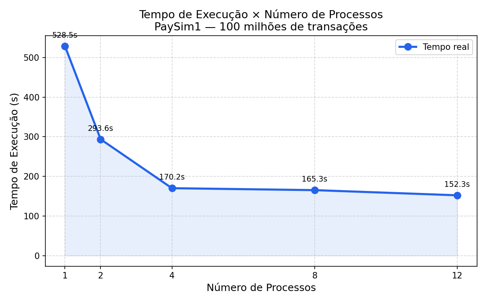
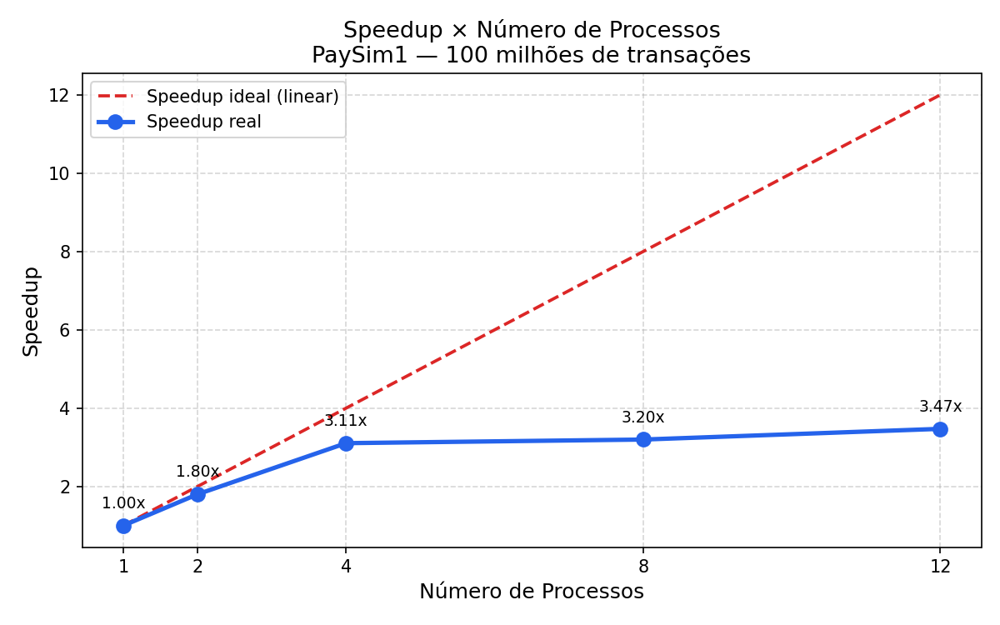
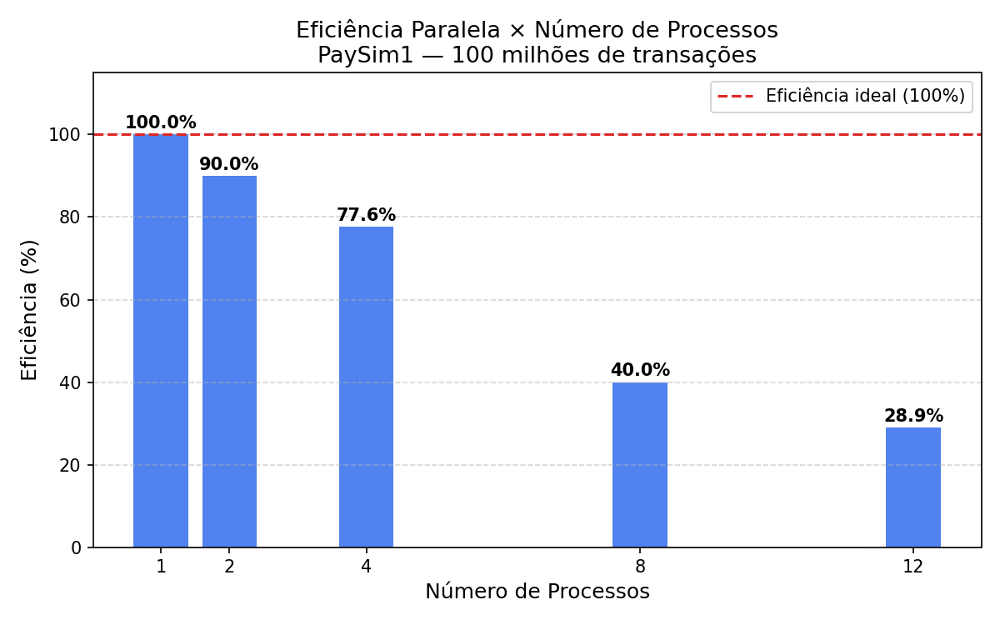

# Relatório — Detecção de Fraudes em Transações Bancárias com Computação Paralela

**Disciplina:** Programação Concorrente e Distribuída
**Aluno(s):** Kelvin Raphael de Souza Pereira
**Turma:**
**Professor:**
**Data:**

---

## 1. Descrição do Problema

O problema consiste em analisar um dataset de transações financeiras (PaySim1) contendo **203.603.840 registros** (~15 GB), aplicando técnicas de detecção de fraudes e medindo o desempenho entre execução serial e paralela com diferentes números de processos.

**Algoritmo utilizado:** Leitura do arquivo CSV em chunks de 1.000.000 linhas, com processamento sequencial (serial) e paralelo via `multiprocessing.Pool` — calculando estatísticas de fraude, z-score e classificação de risco por transação.

**Tamanho da entrada:** 100.000.000 transações financeiras carregadas em memória para o benchmark (subset do dataset de 15 GB).

**Objetivo da paralelização:** Reduzir o tempo de execução distribuindo os chunks entre múltiplos processos, contornando o GIL do Python com `multiprocessing`.

**Complexidade aproximada:** O(n) por chunk, onde n é o número de transações.

**Cálculos realizados em cada chunk:**

1. **Contagem de transações e fraudes** — soma dos registros onde `isFraud = 1` e valor total movimentado (`amount`).

2. **Z-score por tipo de transação** — para cada um dos 5 tipos (PAYMENT, TRANSFER, CASH_OUT, CASH_IN, DEBIT), calcula média e desvio padrão e identifica transações com z-score > 3 como outliers suspeitos.

3. **Classificação de risco por transação** — classifica cada transação como ALTO, MÉDIO ou BAIXO risco com base no tipo e valor, identificando transações suspeitas não detectadas pelo sistema.

Ao final, `consolidar_resultados()` soma os resultados de todos os chunks.

---

## 2. Ambiente Experimental

| Item | Descrição |
|------|-----------|
| Processador | Intel(R) Core(TM) i5-4590 CPU @ 3.30GHz |
| Número de núcleos | 4 núcleos físicos / 4 lógicos |
| Memória RAM | 16,0 GB |
| Sistema Operacional | Windows 10 Home |
| Linguagem utilizada | Python 3.14 |
| Biblioteca de paralelização | multiprocessing (Pool + map) |
| Versão do Python | 3.14 |

---

## 3. Metodologia de Testes

**Medição de tempo:** Utilizou-se `time.time()` antes e depois do processamento dos chunks, excluindo o tempo de leitura do arquivo para garantir comparação justa entre serial e paralelo.

**Número de execuções:** 1 execução por configuração.

**Entrada utilizada:** 100 chunks de 1.000.000 linhas (100 milhões de transações), carregados previamente em memória a partir do `paysim_grande.csv`.

**Configurações testadas:**
- 1 processo (serial)
- 2 processos
- 4 processos
- 8 processos
- 12 processos

**Estratégia de paralelização:**

Os chunks carregados em memória foram distribuídos via `multiprocessing.Pool.map()`, que executa `processar_chunk()` em paralelo. Por usar processos (não threads), o GIL do Python não limita o desempenho — cada processo tem seu próprio interpretador e executa em um núcleo físico diferente.

---

## 4. Resultados Experimentais

| Nº de Processos | Tempo de Execução (s) |
|-----------------|----------------------|
| 1 (serial) | 528.5361 |
| 2 | 293.5872 |
| 4 | 170.1957 |
| 8 | 165.2813 |
| 12 | 152.2672 |

---

## 5. Cálculo de Speedup e Eficiência

**Fórmulas utilizadas:**

```
Speedup(p)    = T(1) / T(p)
Eficiência(p) = Speedup(p) / p
```

---

## 6. Tabela de Resultados

| Processos | Tempo (s) | Speedup | Eficiência |
|-----------|-----------|---------|------------|
| 1 | 528.5361 | 1.00 | 1.00 (100%) |
| 2 | 293.5872 | 1.80 | 0.90 (90%) |
| 4 | 170.1957 | 3.11 | 0.78 (77.6%) |
| 8 | 165.2813 | 3.20 | 0.40 (40%) |
| 12 | 152.2672 | 3.47 | 0.29 (28.9%) |

---

## 7. Gráfico de Tempo de Execução



**Observação:** O tempo cai significativamente de 1 para 4 processos. A partir de 8 processos o ganho é menor, pois o processador possui apenas 4 núcleos físicos.

---

## 8. Gráfico de Speedup



**Observação:** O speedup real acompanha bem o ideal até 4 processos. A curva desacelera acima disso, demonstrando o efeito da Lei de Amdahl e a limitação de núcleos físicos.

---

## 9. Gráfico de Eficiência



**Observação:** A eficiência começa alta (90% com 2 processos) e cai à medida que o número de processos supera os núcleos físicos disponíveis, pois o sistema passa a fazer escalonamento de processos.

---

## 10. Análise dos Resultados

O speedup obtido foi real e significativo até 4 processos, atingindo **3.11x** com eficiência de **77.6%**. O comportamento observado é explicado pelos seguintes fatores:

- **Até 4 processos:** cada processo ocupa um núcleo físico distinto, o paralelismo é genuíno e o speedup cresce de forma próxima ao ideal.
- **8 e 12 processos:** o ganho marginal diminui pois o processador possui apenas 4 núcleos. O sistema operacional passa a escalonar processos, gerando overhead de troca de contexto.
- **Overhead do multiprocessing:** a criação de processos e a serialização dos dados (pickle) adicionam custo fixo, limitando o speedup máximo abaixo do ideal teórico.
- **Lei de Amdahl:** a fração serial do código (consolidação de resultados, I/O) impõe um teto natural ao speedup, independentemente do número de processos.

**Comparação com threads:** se fossem usadas threads (`threading`) em vez de processos, o resultado seria pior para operações CPU-bound, pois o GIL do Python impede execução paralela real de código Python entre threads.

---

## 11. Conclusão

O projeto demonstrou que o paralelismo via `multiprocessing` traz ganho real de desempenho para análise de grandes volumes de dados. Com 4 processos, o tempo de processamento caiu de **528 segundos** para **170 segundos** — uma redução de **67,8%** com eficiência de **77,6%**.

O uso de processos em vez de threads foi fundamental para contornar o GIL do Python e obter paralelismo genuíno em operações CPU-bound como z-score e classificação de risco.

O aumento artificial do dataset para **15 GB** (203 milhões de transações) foi necessário para que o tempo de processamento fosse suficientemente alto para evidenciar os ganhos do paralelismo.

**Dataset:** PaySim1 — Kaggle ([link](https://www.kaggle.com/datasets/ealaxi/paysim1))
**Autor:** Kelvin Raphael de Souza Pereira
